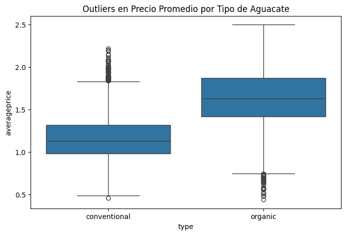

# Normalización y Limpieza de Datos — Avocado Prices 🥑

**Archivo:** `normalizacion_avocado.md`

**Resumen breve**
Este documento describe el flujo completo realizado para limpiar, detectar y tratar outliers, transformar fechas y normalizar (Z-Score) el dataset _Avocado Prices_. Incluye explicaciones conceptuales, fragmentos de código usados en el notebook y observaciones sobre los resultados.

## 1️⃣ Revisión y limpieza inicial
Se revisó la estructura con `df.info()` y `df.describe()` para detectar nulos y tipos de datos. No se encontraron valores nulos significativos.

Pasos aplicados:
- Eliminación de la columna `Unnamed: 0` (índice redundante).
- Conversión de `Date` a `datetime`.
- Creación de `days_since_start` (días desde la primera observación) para usar la fecha como variable numérica.
- Extracción del `month` para análisis estacional.
- Renombramiento de las columnas PLU (4046, 4225, 4770) a nombres descriptivos para mayor legibilidad.

```python
# Limpieza y columnas derivadas
df.drop(columns=['Unnamed: 0'], inplace=True)
df['Date'] = pd.to_datetime(df['Date'])
df['days_since_start'] = (df['Date'] - df['Date'].min()).dt.days
df['month'] = df['Date'].dt.month

# Renombrar PLU y columnas con espacios
df.rename(columns={
    '4046': 'small_hass_sold',
    '4225': 'large_hass_sold',
    '4770': 'xlarge_hass_sold',
    'AveragePrice': 'averageprice',
    'Total Volume': 'total_volume',
    'Total Bags': 'total_bags',
    'Small Bags': 'small_bags',
    'Large Bags': 'large_bags',
    'XLarge Bags': 'xlarge_bags'
}, inplace=True)
```

**Comentario:** se mantuvieron `total_bags` y el desglose por tipo de bolsa porque representan **empaque** (unidad distinta a PLU). Las columnas `*_hass_sold` reflejan conteos por PLU (unidades vendidas por tamaño).

---

## 2️⃣ Detección y tratamiento de datos atípicos (outliers)
### 2.1 ¿Por qué tratarlos?
Los outliers pueden distorsionar medias, varianzas y afectar el ajuste de modelos. En este dataset, las variables de volumen (`total_volume`, `*_hass_sold`, `*_bags`) muestran colas largas, por lo que es necesario detectarlos y decidir una estrategia.

### 2.2 Método seleccionado: IQR (Interquartile Range)
Se eligió IQR por su robustez frente a distribuciones asimétricas. Se definieron límites por variable:

\( lower = Q1 - 1.5 \times IQR \)
\( upper = Q3 + 1.5 \times IQR \)

**Estrategia aplicada:** en lugar de eliminar filas, **se caparon** (winsorize) los valores fuera de los límites substituyéndolos por el límite inferior o superior correspondiente. Esto preserva el tamaño de muestra y evita perder información útil.

```python
numeric_cols = [
    'averageprice', 'total_volume', 'small_hass_sold', 'large_hass_sold',
    'xlarge_hass_sold', 'total_bags', 'small_bags', 'large_bags', 'xlarge_bags'
]

for col in numeric_cols:
    Q1 = df[col].quantile(0.25)
    Q3 = df[col].quantile(0.75)
    IQR = Q3 - Q1
    lower = Q1 - 1.5 * IQR
    upper = Q3 + 1.5 * IQR
    df[col] = np.where(df[col] < lower, lower,
              np.where(df[col] > upper, upper, df[col]))
```

### 2.3 Visualización antes/después
- Boxplots generales para todas las variables numéricas (orientados horizontalmente) para detectar outliers globales.


- Boxplot de `averageprice` por `type` (conventional vs organic).



- Scatter `total_volume` vs `averageprice` (eje X en escala log) para ver cómo se comportan los outliers respecto al volumen.

!(./img/scatterplotPrecioVTotal.png)

**Observación visual:** existían outliers en volúmenes grandes y precios extremos; después del capado con IQR, las colas quedaron menos pronunciadas.

---

## 3️⃣ Análisis cuantitativo de outliers
Para `averageprice` se calculó el conjunto de observaciones fuera de los límites IQR.


```python
# Cálculo de límites con IQR, IQR es el rango intercuartílico
Q1 = df['averageprice'].quantile(0.25)
Q3 = df['averageprice'].quantile(0.75)
IQR = Q3 - Q1
limite_inferior = Q1 - 1.5 * IQR
limite_superior = Q3 + 1.5 * IQR

# Separar datos normales y outliers
outliers = df[(df['averageprice'] < limite_inferior) | (df['averageprice'] > limite_superior)]
normales = df[(df['averageprice'] >= limite_inferior) & (df['averageprice'] <= limite_superior)]

#miramos los tamaños de las muestras para verificar la cantidad de outliers

outliers.shape, normales.shape

#como resultado tenemos 
((0, 15), (18249, 15))
```

- Comparación del `averageprice` con y sin outliers


**Resultado observado:** el precio promedio con y sin outliers fue aproximadamente `1.40`, lo que indica que los outliers no alteran de forma significativa el promedio del dataset global (probablemente por su baja proporción o por distribución balanceada de extremos altos y bajos).

---

## 4️⃣ Codificación de variables categóricas
Se aplicó codificación dummy solo a `type` para evitar explotar la dimensionalidad por `region`:

```python
df = pd.get_dummies(df, columns=['type'], drop_first=True)
# Genera la columna `type_organic` (True si es organic)
```

**Motivo:** `region` tiene muchas categorías (alto cardinality), por lo que convertirla en dummies aumentaría mucho las columnas y complicaría modelos sencillos. Si fuera necesario, se pueden usar técnicas alternativas (target encoding, embeddings, clustering de regiones, etc.).

---

## 5️⃣ Escalado estandarizado (Z-Score)
Se identificaron las columnas numéricas a escalar y se aplicó `StandardScaler`:

```python
cols_to_scale = [
    'averageprice', 'total_volume', 'small_hass_sold', 'large_hass_sold',
    'xlarge_hass_sold', 'total_bags', 'small_bags', 'large_bags', 'xlarge_bags'
]

scaler = StandardScaler()
df_scaled = df.copy()
df_scaled[cols_to_scale] = scaler.fit_transform(df[cols_to_scale])
```

**Verificación:**
```python
print(df_scaled.info())
print(df_scaled.describe().T.head())

#como resultado tenemos

<class 'pandas.core.frame.DataFrame'>
RangeIndex: 18249 entries, 0 to 18248
Data columns (total 15 columns):
 #   Column            Non-Null Count  Dtype         
---  ------            --------------  -----         
 0   Date              18249 non-null  datetime64[ns]
 1   averageprice      18249 non-null  float64       
 2   total_volume      18249 non-null  float64       
 3   small_hass_sold   18249 non-null  float64       
 4   large_hass_sold   18249 non-null  float64       
 5   xlarge_hass_sold  18249 non-null  float64       
 6   total_bags        18249 non-null  float64       
 7   small_bags        18249 non-null  float64       
 8   large_bags        18249 non-null  float64       
 9   xlarge_bags       18249 non-null  float64       
 10  year              18249 non-null  int64         
 11  region            18249 non-null  object        
 12  days_since_start  18249 non-null  int64         
 13  month             18249 non-null  int32         
 14  type_organic      18249 non-null  bool          
dtypes: bool(1), datetime64[ns](1), float64(9), int32(1), int64(2), object(1)
memory usage: 1.9+ MB
None
                   count                           mean                  min  \
Date               18249  2016-08-13 23:30:43.498273792  2015-01-04 00:00:00   
...
averageprice                0.648259             2.772605  1.000027  
total_volume                0.388931              2.09939  1.000027  
small_hass_sold             0.418119             2.083229  1.000027  
large_hass_sold             0.386784             2.045275  1.000027  
Output is truncated. View as a scrollable element or open in a text editor. Adjust cell output settings...
```

Salida ejemplo (resumen):
- `df_scaled` contiene 18249 filas y 15 columnas.
- Las columnas numéricas escaladas tienen media cercana a 0 y desviación estándar cercana a 1.

---

